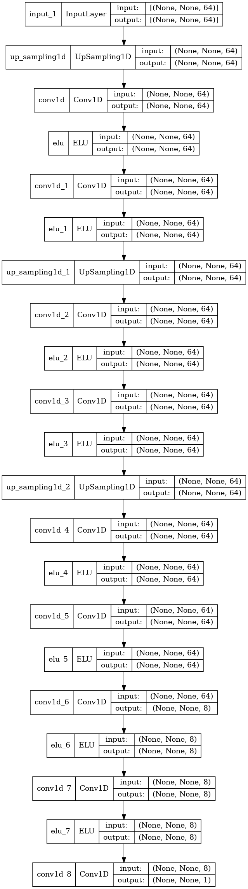
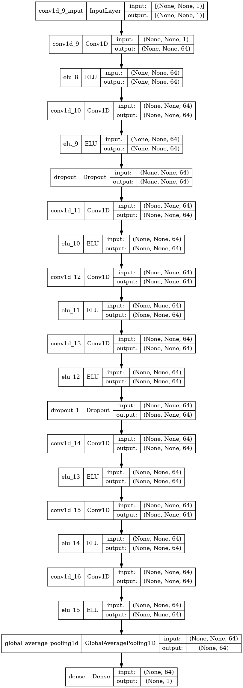

[](https://arxiv.org/abs/2305.16729)

This repository contains additional experiments and code in the paper [Evaluating generation of chaotic time series by convolutional generative adversarial networks](https://arxiv.org/abs/2305.16729) by Y. Tanaka and Y. Yamaguti. 

This repository contains code to define and train GAN models for generating chaotic time series and to analyze the generated time series nonlinear time series.


## Online Supplementary Material

[The online supplementary material (PDF file) is available here.](Supplementary_ChaosGAN.pdf)

## Requirements

These codes were developed using Tensorflow 2.7 and Python 3.9.10.

## Files

- `chaosgan.py` trains Generator and Discriminator.

- `chaosgan_analysis.py` performs analysis of GAN-generated time-series. (including results in Fig. 1 - Fig. 3 )

- `chaosgan_errors.py` performs analysis of errors (including results in Fig. 4).

- `chaosmap.py` defines several chaos maps.

- `models.py` defines GAN models

- `nltsa.py` implements nonlinear time series analysis algorithms.

- `tools.py` defines trajectory generator class, transition error calculation class, and plotting functions.

- `parzen.py` implements Parzen window (kernel density estimation) method and estimation of KL divergence.


## Usage

### Training models

```
python chaosgan.py
```

### Running analysis

After the training, run

```
python chaosgan_analysis.py
```

and then: 

```
python chaosgan_errors.py
```


## Citation

If you use this code in your research, please cite our paper:

```
@misc{tanaka2023evaluating,
      title={Evaluating generation of chaotic time series by convolutional generative adversarial networks}, 
      author={Yuki Tanaka and Yutaka Yamaguti},
      year={2023},
      eprint={2305.16729},
      archivePrefix={arXiv},
      primaryClass={cs.CL}
}
```

## Model Architecture


The graphs shows architecture of the generator and discriminator.
These graphs are generated by  `tf.keras.utils.plot_model()`.

### Generator


### Discriminator

